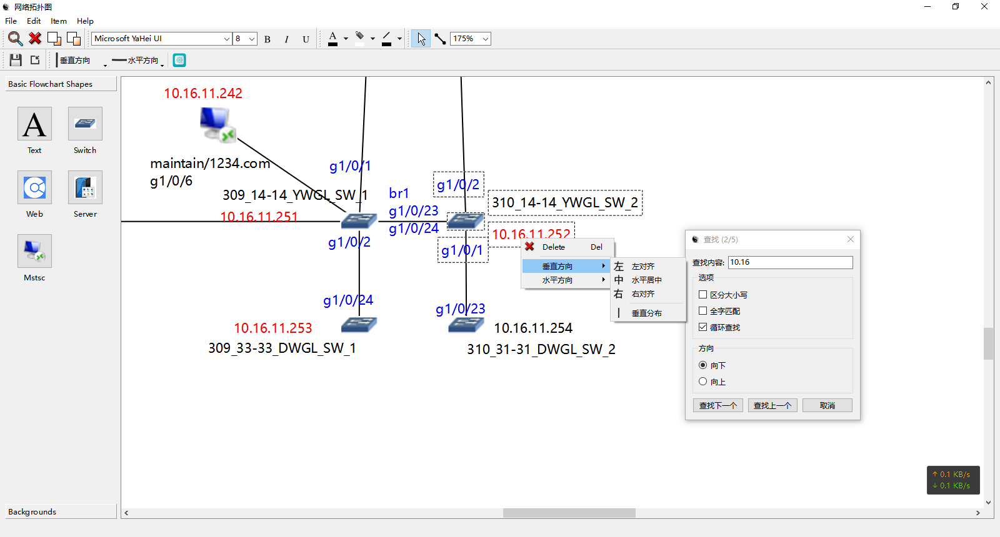

## 网络拓扑图运维管理工具
### 项目地址

|标题|链接  |
|--|--|
| centos_7_zabbix_5.0.x_mysql | [centos_7_zabbix_5.0.x_mysql](https://github.com/NoYoWiFi/zabbix/tree/centos_7_zabbix_5.0.x_mysql) |
| centos_7_zabbix_7.0.x_mysql | [centos_7_zabbix_7.0.x_mysql](https://github.com/NoYoWiFi/zabbix/tree/centos_7_zabbix_7.0.x_mysql) |
| centos_7_zabbix_7.0.x_pgsql | [centos_7_zabbix_7.0.x_pgsql](https://github.com/NoYoWiFi/zabbix/tree/centos_7_zabbix_7.0.x_pgsql) |
| rocky_8_zabbix_6.0.x_mysql | [rocky_8_zabbix_6.0.x_mysql](https://github.com/NoYoWiFi/zabbix/tree/rocky_8_zabbix_6.0.x_mysql) |
| rocky_8_zabbix_6.0.x_pgsql | [rocky_8_zabbix_6.0.x_pgsql](https://github.com/NoYoWiFi/zabbix/tree/rocky_8_zabbix_6.0.x_pgsql) |
| rocky_8_zabbix_7.0.x_mysql | [rocky_8_zabbix_7.0.x_mysql](https://github.com/NoYoWiFi/zabbix/tree/rocky_8_zabbix_7.0.x_mysql) |
| rocky_8_zabbix_7.0.x_pgsql | [rocky_8_zabbix_7.0.x_pgsql](https://github.com/NoYoWiFi/zabbix/tree/rocky_8_zabbix_7.0.x_pgsql) |
| zabbix_6.0.x_docker | [zabbix_6.0.x_docker](https://github.com/NoYoWiFi/zabbix/tree/zabbix_6.0.x_docker) |
| zabbix_6.0.x_dockerfile | [zabbix_6.0.x_dockerfile](https://github.com/NoYoWiFi/zabbix/tree/zabbix_6.0.x_dockerfile) |
| zabbix_7.0.x_docker | [zabbix_7.0.x_docker](https://github.com/NoYoWiFi/zabbix/tree/zabbix_7.0.x_docker) |
| zabbix_7.0.x_dockerfile | [zabbix_7.0.x_dockerfile](https://github.com/NoYoWiFi/zabbix/tree/zabbix_7.0.x_dockerfile) |
| zabbix_api | [zabbix_api](https://github.com/NoYoWiFi/zabbix/tree/zabbix_api) |
| zabbix_7.0.x_build | [zabbix_7.0.x_build](https://github.com/NoYoWiFi/zabbix/tree/zabbix_7.0.x_build) |
| diagramscene | [diagramscene](https://github.com/NoYoWiFi/zabbix/tree/diagramscene) |

**效果图**

1. 操作系统要求以及软件介绍
2. 版本：window
3. 摘要：实现了绘制拓扑图并且支持双击Switch图标打开SSH连接目标服务器，双击Web图标打开浏览器访问目标网址。

`感谢打赏`  
  
| 微信                                                                                        | 支付宝                                                                                        |  
|-------------------------------------------------------------------------------------------|--------------------------------------------------------------------------------------------|  
|  |  |  

**全文完结**

